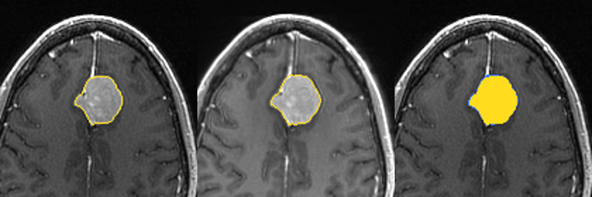

# Comparar dos estudios del mismo tumor (MRBrainTumor1 y MRBrainTumor2)

Los datos de ejemplo de 3D Slicer incluyen dos resonancias del mismo paciente. Este ejercicio las alinea (registro de imágenes), segmenta el tumor en cada una con el mismo método y compara el resultado.

> Ejercicio académico con datos públicos de ejemplo. No es un diagnóstico ni sirve para decidir tratamientos.



*Izquierda: estudio 1. Centro: estudio 2 ya alineado sobre el 1. Derecha: superposición (amarillo = coincide en ambos; rojo = solo estudio 1; azul = solo estudio 2).*

## Resultados

| Medida | Estudio 1 | Estudio 2 |
|---|---|---|
| Volumen del tumor | 16,94 cm³ | 18,51 cm³ |
| Intensidad media | 179 | 233 |

| Comparación | Valor |
|---|---|
| Cambio de volumen | +1,57 cm³ (+9,3 %) |
| Solapamiento (coeficiente de Dice) | 0,955 |
| Desplazamiento del centroide | 0,48 mm |
| Correlación de intensidades tras el registro | 0,82 |

## Cómo leer estos números

- **Dice = 0,955** significa que las dos segmentaciones coinciden en casi todo (1 es coincidencia perfecta). El tumor está prácticamente en el mismo sitio.
- **+1,57 cm³ no es concluyente.** Es una segmentación semiautomática, sin una referencia hecha por un especialista, y un cambio de ese tamaño es parecido al error esperable del método. No se puede afirmar que el tumor haya crecido.
- **La intensidad media no es comparable entre estudios.** Las intensidades de una resonancia dependen del equipo, de los ajustes y del contraste; por eso cambian de 179 a 233 sin que eso diga nada sobre el tejido.
- No sé si las dos resonancias son de días distintos o de la misma sesión: la documentación de los datos de ejemplo no lo dice, así que no se interpreta el cambio de volumen como evolución.

## Método

1. **Registro** con BRAINSFit (rígido, escala y afín) del estudio 2 sobre el 1. Es un registro lineal: no corrige deformaciones del cerebro.
2. **Segmentación** de cada estudio con estimación inicial del tumor, semillas y Grow from seeds, más suavizado Median de 3 mm e Islands (misma receta del tutorial `04-tutorial-3dslicer`).
3. **Comparación** del volumen, el Dice y la distancia entre centroides.

## Cómo repetirlo

```bash
# con la interfaz de Slicer abierta (Grow from seeds falla sin ventana)
Slicer.exe --python-script scripts/comparar.py
```

Ajusta las variables de entorno `DATA_DIR` (carpeta con `MRBrainTumor1.nrrd`, `MRBrainTumor2.nrrd` y `explora.json`) y `OUT_DIR`. `explora.json` guarda la posición aproximada del tumor en el estudio 1 (`centro_kji`, en índices de vóxel).

## Limitaciones

- Dos estudios de un solo paciente, sin segmentación experta de referencia.
- El método depende de una estimación inicial por umbral, que se ajustó a este caso.
- Registro lineal: si el cerebro se deformó entre estudios, el Dice subestimaría el solapamiento real.
