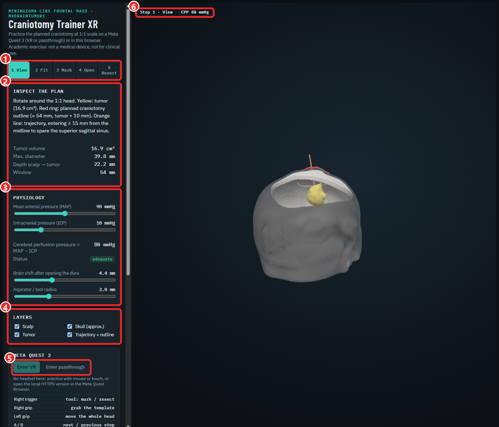
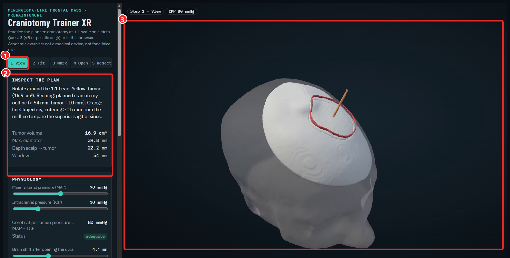
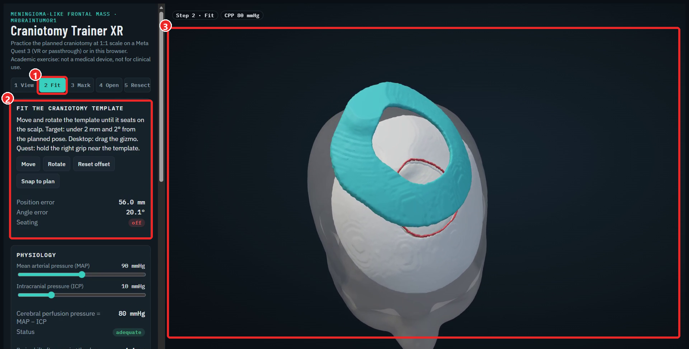
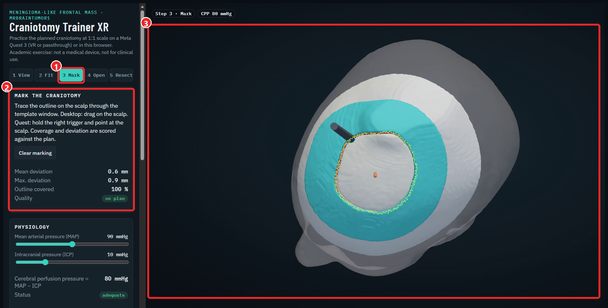
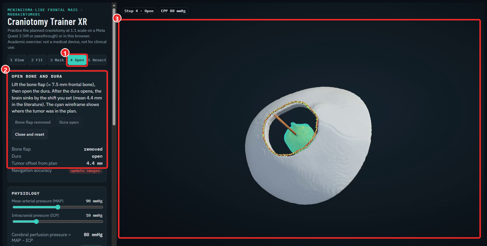
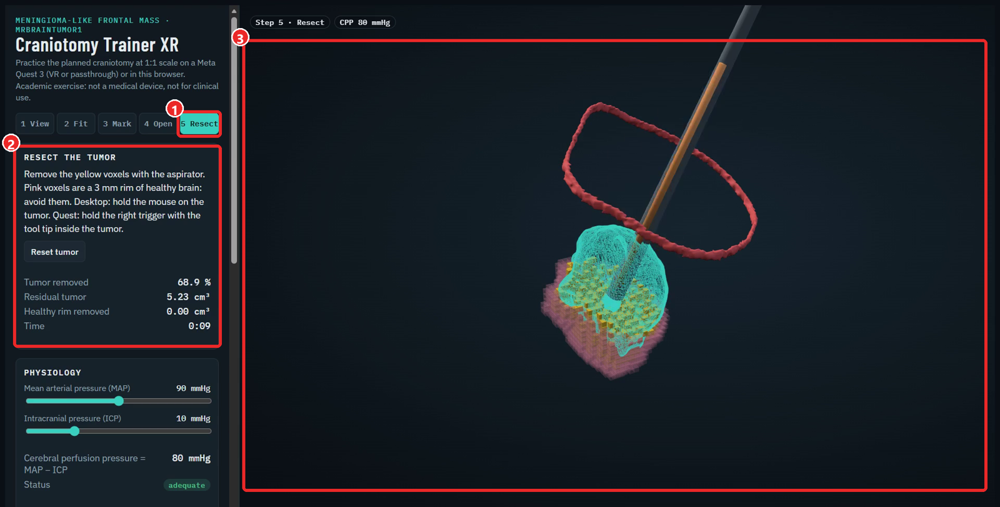
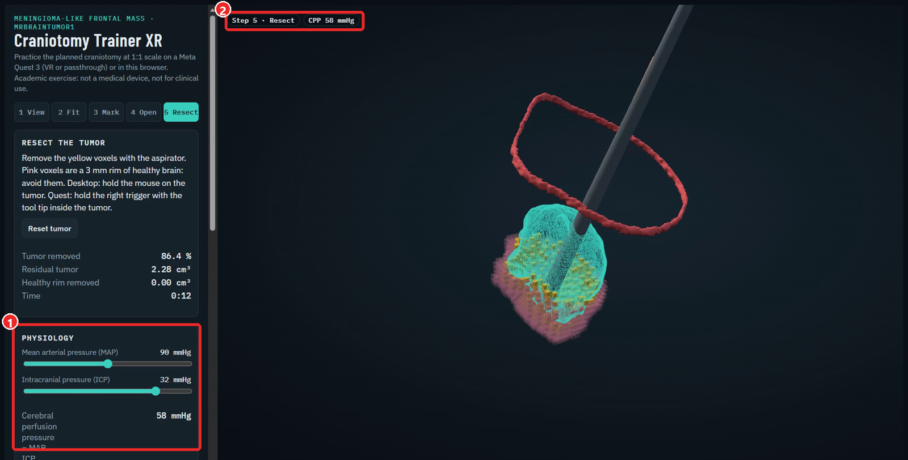

# Tutorial: simulación quirúrgica en VR de una craneotomía

Aprende a usar, y a construir, un simulador para **practicar una craneotomía** sobre el caso del tumor cerebral de este repositorio, a escala real, en el navegador o en unas **Meta Quest 3**.

> **Ejercicio académico con datos públicos de ejemplo.** No es un dispositivo médico, no enseña a operar y no sirve para planificar ni realizar cirugías. El cráneo es una aproximación y la mecánica de los tejidos está muy simplificada.

**Simulador en línea:** https://andresnenger.github.io/segmentacion-tumores-3dslicer/

**Qué necesitas:** un navegador moderno (Edge o Chrome) para la versión de escritorio. Las Meta Quest 3 son opcionales.

**Tiempo:** unos 20 minutos para el uso; el apartado "Cómo se construyó" necesita 3D Slicer, Blender y Node.js.

> **Qué está probado y qué no.** Probé en el navegador de un PC los cinco pasos (ajuste, marcado, apertura, resección y fisiología). **No lo he probado con unas Quest 3**: los controles de las gafas están programados, pero sin verificar.

---

## Parte 1 · Usar el simulador

### 1. Abre el simulador y reconoce la pantalla

Entra en la dirección de arriba. Se carga la cabeza a escala 1:1, con el tumor (amarillo), el contorno de la craneotomía (rojo) y la trayectoria (naranja).



1. **Pasos:** cinco botones, de *1 View* a *5 Resect*.
2. **Tarjeta del paso:** qué hacer en ese paso y las medidas que se calculan.
3. **Fisiología:** presión arterial, presión intracraneal, desplazamiento cerebral y radio de la herramienta.
4. **Capas:** muestra u oculta el cuero cabelludo, el cráneo, el tumor y la trayectoria.
5. **Meta Quest 3:** botones para entrar en VR o en realidad mixta (se activan solo si el navegador detecta unas gafas).
6. **Indicadores:** el paso actual y la presión de perfusión cerebral (CPP).

**Mover la cámara:** arrastra con el botón izquierdo para girar, rueda para acercar, botón derecho para desplazar.

### 2. Paso 1 · Inspeccionar el plan



Gira la cabeza y observa. El tumor mide 16,9 cm³ y queda a 22,2 mm de profundidad bajo el cuero cabelludo. La trayectoria entra a 15 mm o más de la línea media, para no dañar el seno sagital superior (una vena grande que corre por el centro). La ventana de craneotomía mide unos 54 mm: el tumor más un margen de 10 mm.

**Pruébalo:** desmarca *Skull* y *Scalp* en *Layers* y mira cómo queda el tumor respecto a la línea media.

### 3. Paso 2 · Colocar la plantilla



La plantilla es una pieza que se apoya en el cuero cabelludo y deja libre la ventana de la craneotomía. Empieza descolocada (aquí, 56 mm y 20° de error).

- En el navegador: pulsa *Move* o *Rotate* y arrastra los ejes que aparecen sobre la plantilla.
- En las Quest: acerca el mando derecho a la plantilla y agárrala con el **grip**.

El panel muestra el **error de posición** y el **error de ángulo**. Cuando bajan de **2 mm y 2°**, el indicador pasa a *seated* (asentada). *Snap to plan* la coloca de golpe.

### 4. Paso 3 · Marcar la craneotomía



Con la plantilla puesta, traza el contorno de la ventana sobre el cuero cabelludo.

- En el navegador: mantén pulsado el botón del ratón y arrastra siguiendo el borde.
- En las Quest: mantén el **gatillo derecho** apuntando al cuero cabelludo.

El panel calcula la **desviación media y máxima** respecto al contorno planificado y el **porcentaje del contorno cubierto**. Se considera *on plan* con menos de 2 mm de desviación media y más del 80 % cubierto. *Clear marking* borra el trazo.

### 5. Paso 4 · Abrir el hueso y la duramadre



1. Pulsa *Lift bone flap*: se levanta el colgajo de hueso (≈ 7,5 mm de espesor).
2. Pulsa *Open dura* (la duramadre es la membrana que cubre el cerebro).
3. El cerebro **se desplaza**: el tumor ya no está donde lo mostraba la imagen. La silueta cian es la posición planificada. Con el valor medio descrito en la literatura (4,4 mm), el panel avisa *update images* (las imágenes ya no son fiables) porque el desplazamiento supera los 3 mm.

**Pruébalo:** mueve el control *Brain shift* de 0 a 12 mm y mira cuándo el indicador pasa de *plan valid* (menos de 2 mm) a *re-check* (menos de 3 mm) y a *update images*.

### 6. Paso 5 · Resecar el tumor



El tumor y un anillo de 3 mm de tejido sano están hechos de pequeños cubos (vóxeles). Los amarillos son tumor; los rosas, tejido sano que hay que conservar.

- En el navegador: mantén pulsado el ratón sobre el tumor.
- En las Quest: mantén el **gatillo derecho** con la punta de la herramienta dentro del tumor.

Solo se puede resecar con el colgajo levantado y la duramadre abierta. El panel muestra el **porcentaje de tumor retirado**, el **tumor residual**, el **tejido sano retirado** y el **tiempo**. Con *Aspirator radius* eliges el tamaño de la herramienta (de 1,5 a 6 mm): una más grande es más rápida, pero más fácil de pasarse al tejido sano.

**Qué buscar:** retirar el máximo de tumor sin tocar los vóxeles rosas. Una resección cuidadosa suele dejar algo de tumor junto al borde; ese es el compromiso real de la cirugía.

### 7. Fisiología: presión de perfusión



La **presión de perfusión cerebral** (CPP) es la presión que empuja la sangre al cerebro: **CPP = PAM − PIC** (presión arterial media menos presión intracraneal).

| Parámetro | Referencia | Alarma en el simulador |
|---|---|---|
| Presión intracraneal (PIC) | normal 5-15 mmHg | por encima de 15 aparece un aviso |
| CPP | por debajo de 60 mmHg sube el riesgo de isquemia | menos de 60: *ischemia risk*; más de 100: *high* (umbral del simulador) |

**Pruébalo:** sube la PIC a 32 mmHg con la presión arterial en 90: la CPP cae a 58 mmHg y salta la alarma.

La fisiología es **informativa**: se calcula con los valores que eliges y no reacciona a lo que haces en la cirugía.

### 8. Practicar en Meta Quest 3

1. Abre la dirección del simulador en el **Meta Quest Browser** (o carga el archivo, ver `01-tumor-cerebral/simulador-quest/LEEME.txt`).
2. Pulsa **Enter VR** (realidad virtual) o **Enter passthrough** (ves tu habitación con el simulador encima).

| Control | Acción |
|---|---|
| Gatillo derecho | herramienta: marcar el contorno o resecar |
| Grip derecho | agarrar la plantilla |
| Grip izquierdo | mover toda la cabeza (para alinearla con un maniquí impreso en passthrough) |
| A / B | paso siguiente / anterior |
| X / Y | mostrar u ocultar cuero cabelludo / cráneo |
| Stick derecho arriba/abajo | radio de la herramienta, o desplazamiento cerebral en el paso 4 |

El mando izquierdo muestra un panel con el paso, las medidas y la CPP.

**Con el maniquí impreso:** en `01-tumor-cerebral/modelos-impresion/` están la plantilla y el modelo del tumor. En passthrough, mueve la cabeza virtual con el grip izquierdo hasta alinearla con un maniquí real.

---

## Parte 2 · Cómo se construyó (para recrearlo)

El simulador es una cadena de cinco pasos; cada uno produce un archivo que usa el siguiente. Los scripts están en `01-tumor-cerebral/scripts/`.

| Paso | Script | Qué produce |
|---|---|---|
| 1 | `t2_seg.py` | Segmentación del tumor en 3D Slicer (ver el tutorial `04-tutorial-3dslicer`). |
| 2 | `t3_plan.py` | Trayectoria, ventana de craneotomía, plantilla, contorno y piel (archivos STL). |
| 3 | `t6_vr_assets.py` | Cráneo aproximado, colgajo óseo, vóxeles del tumor y del tejido sano, y `vr_data.json`. |
| 4 | `t7_glb.py` | Blender convierte los STL en una escena `vr_escena_tumor.glb` (unos 3 MB). |
| 5 | `simulador-quest/index.html` | La aplicación (three.js + WebXR): carga el GLB y el JSON, y calcula las medidas. |
| 6 | `build_archivo_unico.js` | Empaqueta todo en un solo HTML sin dependencias (4,8 MB). |

### Decisiones de diseño que conviene entender

- **Unidades y ejes.** La escena se exporta en metros y con el eje Y hacia arriba (convención de glTF): `(x, y, z) = (derecha, superior, −anterior) / 1000`. Si el modelo aparece girado o enorme, casi siempre es una unidad o un eje.
- **Cráneo aproximado.** Una resonancia T1 no muestra bien el hueso, así que el cráneo se modela como una capa de 7,5 mm bajo 4 mm de cuero cabelludo.
- **Resección por vóxeles.** El tumor son 4 103 cubos de 1,6 mm; retirar tejido es poner a cero la escala de los cubos que toca la herramienta. Es simple y rápido, no físico.
- **Desplazamiento cerebral.** Es un traslado rígido del tumor en dirección contraria al abordaje, no una simulación del tejido.

### Un solo archivo para las gafas

```bash
npm install three@0.160.0 esbuild
node build_archivo_unico.js
```

Ajusta `SRC` y `OUT` dentro del script. El resultado funciona sin internet y se puede copiar a las Quest por USB.

### Publicar con GitHub Pages

WebXR exige HTTPS, y GitHub Pages lo da gratis: en el repositorio, *Settings → Pages*, rama `main`, carpeta `/docs`, con el HTML como `docs/index.html`.

---

## Ejercicios

- [ ] Mueve *Brain shift* de 0 a 12 mm y anota a partir de qué valor el plan deja de ser fiable.
- [ ] Reseca con radios de 1,5 mm y de 6 mm: compara tiempo, tumor residual y tejido sano retirado.
- [ ] Sube la PIC hasta que la CPP caiga por debajo de 60 mmHg. ¿Qué PAM la devolvería a 70 mmHg?
- [ ] Cambia la posición de la plantilla 5 mm y marca el contorno: ¿cómo cambia la desviación?
- [ ] Cambia el color o el tamaño de los vóxeles en `index.html` y vuelve a empaquetar.

## Limitaciones

- No probado en unas Meta Quest 3.
- Un solo caso (MRBrainTumor1); el cráneo es aproximado.
- Sin mecánica de tejidos validada: la rigidez, el sangrado y la deformación real del cerebro no están modelados.
- Los valores de referencia (espesores, presiones, desplazamiento) proceden de la literatura y se citan en `01-tumor-cerebral/simulador-quest/LEEME_META_QUEST_3.md`.
- Nada de esto reemplaza formación ni supervisión clínica.
